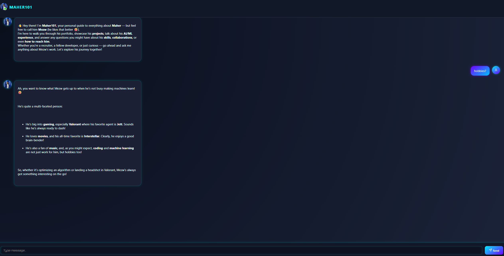

# 🤖 Maher101 – Interactive Portfolio Chatbot

Welcome to **Maher101**, a futuristic, cyberpunk-inspired portfolio chatbot powered by Google Gemini ✨. This app allows users to interact with a smart assistant that represents **Maher (aka Mezw)** and guides them through his professional journey, projects, AI/ML skills, and more — all in a fun, conversational way.



---

## 🛠️ Built With

[](https://reactjs.org/)
[](https://ai.google.dev/)
[](https://vercel.com/)
[](https://lucide.dev)
[](https://marked.js.org)

---

## ✨ Features

- 💬 Chat with an AI-powered portfolio bot
- 🧠 Uses **Google Gemini API** to generate smart, natural responses
- 🖼 Supports Markdown rendering for styled responses
- 🌐 Arabic language detection and support (RTL layout)
- 🎨 Modern, neon-cyberpunk theme with typing animation
- ⚡ Deployed free with **Vercel**
- 🔐 Environment variable support for API key

---

## 🚀 Getting Started

### 1. Clone the repo

```bash
git clone https://github.com/maher-mohsen/Maher-101.git
cd maher101-chatbot
```

### 2. Install dependencies

```bash
npm install
```

### 3. Set up environment variables

Create a `.env` file in the root:

```env
REACT_APP_GEMINI_API_KEY=your_google_gemini_api_key
```

> 🔐 Note: This key may be visible on the client side unless proxied through a secure backend.

### 4. Start development server

```bash
npm start
```

---

## 🧠 Gemini AI Config

The chatbot uses Gemini to simulate a helpful assistant representing Maher. All responses are generated using the Gemini SDK, with prompt instructions tailored to Maher’s resume and portfolio.

JSON reference data is loaded from `public/CV.json`.

---

## 🌍 Deploy to Vercel (Free)

1. Push your project to GitHub.
2. Log in to [https://vercel.com](https://vercel.com)
3. Import your GitHub repo.
4. Add `REACT_APP_GEMINI_API_KEY` in **Project Settings > Environment Variables**.
5. Click **Deploy**!

---

## 📂 Project Structure

```
/public
  ├── CV.json            # Resume data for the bot
  ├── maher.jpg          # Avatar icon
/src
  ├── ChatBot.jsx        # Main component
  ├── ChatBot.css        # Styles (neon/cyberpunk)
.env                     # Gemini API key
README.md
```

---

## 🧠 Credits

- Developed by **Maher Mohsen (Mezw)**
- Gemini SDK by **Google**
- Icons by [Lucide](https://lucide.dev)

---

## 📬 Feedback or Collaboration?

Open an issue or contact Mezw on [LinkedIn](https://www.linkedin.com/in/maher-mohsen).

---

## 📄 License

MIT © 2025 Mezw
